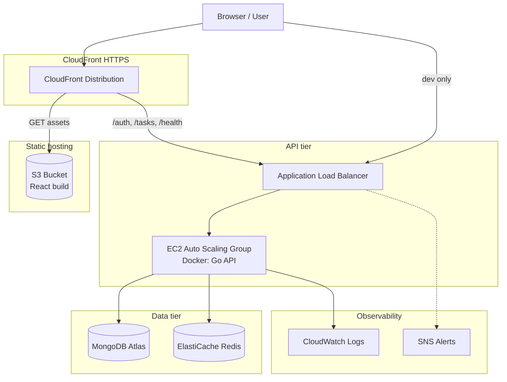
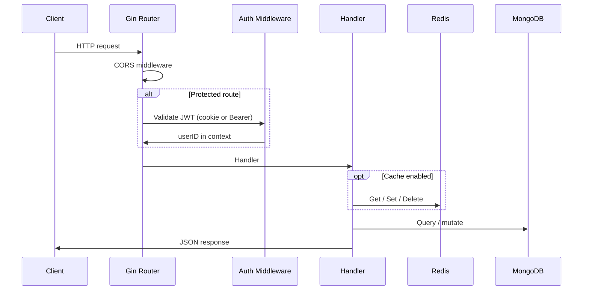
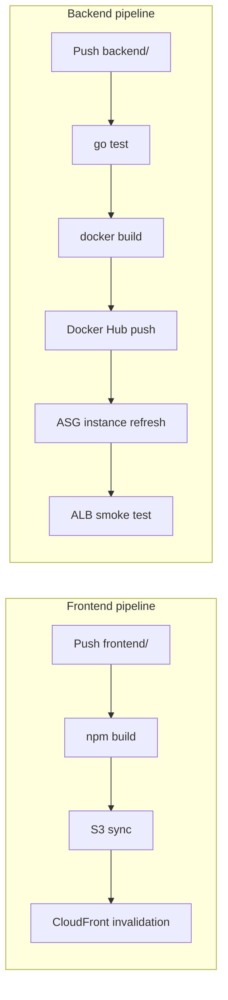

# StartTech Application — System Architecture

## Purpose

StartTech is a full-stack task management application. Users register, authenticate, and manage personal todos. The system is designed for cloud deployment on AWS with horizontal scaling, caching, structured logging, and automated CI/CD.

---

## High-level architecture



---

## Repository boundaries

| Repository | Responsibility |
|------------|----------------|
| **starttech-application** | Application source, Docker image, frontend build, app CI/CD |
| **starttech-infra** | AWS infrastructure as Terraform, infra CI/CD, IAM policies |

The application repo does not contain Terraform. It consumes infrastructure outputs via environment variables and GitHub secrets.

---

## Frontend architecture

### Stack

- **React 18** with **Vite** for bundling
- **TanStack Router** for file-based routing
- **Axios** HTTP client with credentials (`withCredentials: true`)
- **Tailwind CSS** + shadcn/ui components

### Routing

| Route | Purpose |
|-------|---------|
| `/` | Landing |
| `/login`, `/register` | Authentication |
| `/todos` | Task list (protected) |
| `/profile`, `/change-password` | Account management |
| `/health` | Frontend health page |

### API communication

`frontend/src/lib/apiClient.ts` resolves the API base URL:

| Context | Base URL |
|---------|----------|
| Local dev | `http://localhost:8080` |
| Production (HTTPS) | Empty string → **same-origin** requests via CloudFront |
| Explicit override | `VITE_API_BASE_URL` secret at build time |

Same-origin routing avoids mixed-content errors: CloudFront proxies API paths to the ALB over HTTP on the origin side while the browser only speaks HTTPS to CloudFront.

### Authentication (client)

- Login stores JWT in **httpOnly cookie** (`token`) and optionally in `localStorage` for Bearer header fallback.
- Protected routes use `AuthContext` / `useAuth` hook.
- Logout clears cookie via `POST /auth/logout`.

---

## Backend architecture

### Stack

- **Go 1.25** with **Gin** web framework
- **MongoDB** driver for persistence
- **Redis** (go-redis) for optional caching
- **slog** for structured logging
- **JWT** for stateless session tokens
- **Swagger** (swag) for OpenAPI docs

### Layering

```
cmd/api/main.go          → bootstrap, DI, server lifecycle
internal/routes/         → HTTP route map
internal/handlers/       → request/response logic
internal/middleware/     → CORS, JWT validation
internal/cache/          → Cache interface + Redis / NoOp
internal/config/         → Viper env + .env loading
internal/database/       → MongoDB connection
internal/auth/           → JWT issue/validate
internal/logger/         → slog setup, optional CloudWatch writer
internal/models/         → domain types + DTOs
```

### Request lifecycle



### Authentication (server)

1. **Register** — bcrypt password hash, uniqueness check (DB + cache).
2. **Login** — validate credentials, issue JWT, set httpOnly cookie.
3. **Protected routes** — `AuthMiddleware` reads cookie or `Authorization: Bearer`, validates JWT, sets `userID` in Gin context.

### Caching design

Controlled by `ENABLE_CACHE` and `REDIS_ADDR`.

| Component | Behavior |
|-----------|----------|
| `NewCacheService` | Returns `RedisCache` or `NoOpCache` |
| `NoOpCache` | Always cache-miss; app still works without Redis |
| Redis failure at startup | Logs warning, falls back to `NoOpCache` (does not crash) |

**Cache keys and TTLs:**

| Key pattern | TTL | Use case |
|-------------|-----|----------|
| `username-taken:<username>` | 5 min (register) / 24 h (preload) | Fast username checks |
| `username_cache_initialized` | 24 h | Sentinel to skip full preload |
| `todos:user:<userId>` | 1 hour | Cached todo list per user |

**Invalidation:**

- Todo create/update/delete → `Delete(todos:user:<id>)`
- Startup preload → `SetMany` all existing usernames when sentinel missing
- Probabilistic refresh (5%) on username-check endpoint

### Logging design

| Mode | Trigger | Output |
|------|---------|--------|
| Default local | No CloudWatch env | `stdout` via slog |
| Production EC2 | Docker `awslogs` driver | CloudWatch log group `/starttech/<env>/backend` |
| Optional SDK | `CLOUDWATCH_LOG_GROUP` + `CLOUDWATCH_LOG_STREAM` set | Direct `PutLogEvents` from app |

Production primarily relies on **container stdout → awslogs**. Cache lines and slog JSON appear in CloudWatch.

Log format in production user-data: `LOG_FORMAT=json`.

---

## Data model (MongoDB)

### Collections

**`users`**

- `_id`, `firstName`, `lastName`, `username` (lowercase), `password` (bcrypt hash)
- `createdAt`, `updatedAt`

**`todos`**

- `_id`, `userId`, `title`, `description`, `completed`
- `createdAt`, `updatedAt`

Indexes are implied by query patterns (`username`, `userId` on todos). Atlas manages cluster scaling and backups externally.

---

## Production deployment topology

| Component | AWS service | Notes |
|-----------|-------------|-------|
| Frontend assets | S3 + CloudFront OAC | Private bucket, CDN-only access |
| API | ALB → EC2 ASG | Private subnets, port 8080 |
| Outbound internet | NAT Gateway | Atlas access, Docker pull, AWS APIs |
| Cache | ElastiCache Redis 7 | Private subnets, SG: backend only |
| DB | MongoDB Atlas | IP allowlist includes NAT EIP |
| Logs | CloudWatch Logs | Group `/starttech/prod/backend` |
| Alarms | CloudWatch → SNS | ALB 5xx, latency, EC2 CPU scaling |

### EC2 bootstrap (user-data)

On instance launch:

1. Install and start Docker.
2. Pull backend image from Docker Hub.
3. Run container with:
   - `ENABLE_CACHE=true`
   - `REDIS_ADDR=<elasticache>:6379`
   - `MONGO_URI`, `ALLOWED_ORIGINS`, `LOG_FORMAT=json`
   - `--log-driver=awslogs` → CloudWatch

### Scaling

- **ASG** min/max/desired instances (default 1–3).
- **Scale out** when average CPU > 70% (2 evaluation periods).
- **Scale in** when average CPU < 30%.
- **Instance refresh** on backend deploy (rolling, 50% min healthy).

---

## Security architecture

| Area | Implementation |
|------|----------------|
| Network | Backend in private subnets; ALB-only ingress on 8080 |
| Redis | Security group allows 6379 only from backend SG |
| Secrets | `MONGO_URI`, JWT key via env (not in git); GitHub Secrets for CI |
| Auth | bcrypt passwords, JWT in httpOnly cookie |
| CORS | Explicit `ALLOWED_ORIGINS` including CloudFront HTTPS URL |
| Frontend bucket | No public access; CloudFront OAC with SigV4 |
| IAM | Least-privilege policies in `starttech-infra/iam/` |

**Do not commit:** `terraform.tfvars`, `.env`, AWS keys, Atlas credentials, Docker Hub tokens.

---

## CI/CD architecture

### Application pipelines



### Cross-repo secret flow

Infra deploy exports Terraform outputs → GitHub Actions syncs to application repo secrets (`S3_BUCKET_NAME`, `CLOUDFRONT_DISTRIBUTION_ID`, `REACT_APP_API_URL`, CloudWatch names).

---

## Failure modes and resilience

| Failure | System behavior |
|---------|-----------------|
| Redis down at startup | Falls back to `NoOpCache`; `/health` may show cache down if enabled |
| Redis down at runtime | Cache errors logged; handlers fall through to MongoDB |
| MongoDB unreachable | `/health` 503; API errors on data routes |
| Single EC2 unhealthy | ALB routes to healthy targets; ASG replaces instance |
| Stale frontend assets | CloudFront invalidation on deploy |

---

## Related documentation

- [README.md](./README.md) — Setup and deployment guide
- [RUNBOOK.md](./RUNBOOK.md) — Operations and troubleshooting
- [starttech-infra ARCHITECTURE.md](../starttech-infra/ARCHITECTURE.md) — AWS infrastructure detail
