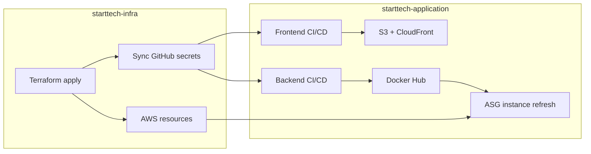

[](https://github.com/esodevops/starttech-application/actions/workflows/frontend-ci-cd.yml) [](https://github.com/esodevops/starttech-application/actions/workflows/backend-ci-cd.yml)

# StartTech Application

Full-stack todo application (React + Go) deployed on AWS. Infrastructure is provisioned separately in the [`starttech-infra`](../starttech-infra/README.md) repository.

| Layer | Technology | Hosting |
|-------|------------|---------|
| Frontend | React (Vite), TypeScript | S3 + CloudFront |
| Backend | Go (Gin), Docker | EC2 Auto Scaling Group + ALB |
| Database | MongoDB | MongoDB Atlas |
| Cache | Redis | AWS ElastiCache |
| Logs | JSON structured logs | CloudWatch Logs (Docker `awslogs`) |

---

## Repository structure

```
starttech-application/
├── frontend/                 # React SPA (Vite)
│   ├── src/
│   │   ├── routes/           # TanStack Router pages
│   │   ├── components/       # UI components
│   │   ├── context/          # Auth context
│   │   └── lib/apiClient.ts  # Axios client (cookies + optional Bearer token)
│   └── package.json
├── backend/                  # Go API
│   ├── cmd/api/main.go       # Entry point
│   ├── internal/
│   │   ├── handlers/         # HTTP handlers (auth, tasks, health)
│   │   ├── cache/            # Redis cache abstraction
│   │   ├── config/           # Viper-based configuration
│   │   ├── logger/           # slog + optional CloudWatch writer
│   │   ├── middleware/       # CORS, JWT auth
│   │   └── routes/           # Route registration
│   ├── Dockerfile
│   └── .env.example
├── scripts/
│   ├── deploy-frontend.sh
│   ├── deploy-backend.sh
│   ├── health-check.sh
│   └── rollback.sh
├── .github/workflows/
│   ├── frontend-ci-cd.yml
│   └── backend-ci-cd.yml
├── README.md
├── ARCHITECTURE.md
└── RUNBOOK.md
```

---

## Prerequisites

| Tool | Version | Purpose |
|------|---------|---------|
| Node.js | 20+ | Frontend development and build |
| Go | 1.25+ | Backend development |
| Docker | Latest | Local/production container builds |
| AWS CLI | v2 | Manual deploys and debugging |
| MongoDB | Atlas or local | Application database |
| Redis | Optional locally | Caching when `ENABLE_CACHE=true` |

Deploying to AWS also requires infrastructure from **starttech-infra** (VPC, ALB, ASG, ElastiCache, S3, CloudFront).

---

## Quick start (local development)

### 1. Clone and configure

```bash
git clone https://github.com/esodevops/starttech-application.git
cd starttech-application
```

### 2. Backend

```bash
cd backend
cp .env.example .env
# Edit .env: set MONGO_URI, JWT_SECRET_KEY, and optionally ENABLE_CACHE / REDIS_ADDR
```

Run without Docker:

```bash
go mod download
go run ./cmd/api
```

Run with Docker:

```bash
docker build -t much-to-do-backend ./backend
docker run -p 8080:8080 \
  -e MONGO_URI="mongodb://localhost:27017" \
  -e JWT_SECRET_KEY="local-dev-secret-key-min-32-chars" \
  -e ENABLE_CACHE=false \
  -e ALLOWED_ORIGINS="http://localhost:5173" \
  much-to-do-backend
```

API base URL: `http://localhost:8080`

- Health: `GET /health`
- Swagger: `GET /swagger/index.html`

### 3. Frontend

```bash
cd frontend
npm ci
npm run dev
```

Open `http://localhost:5173`. The dev server calls the API at `http://localhost:8080` by default (`apiClient.ts`).

### 4. Verify locally

```bash
curl http://localhost:8080/health
# {"cache":"disabled","database":"ok"}  (or cache "ok" if Redis enabled)
```

---

## Environment variables (backend)

Copy `backend/.env.example` to `backend/.env` for local use. In production, EC2 user-data injects key variables (see infra repo).

| Variable | Required | Default | Description |
|----------|----------|---------|-------------|
| `PORT` | No | `8080` | HTTP listen port |
| `MONGO_URI` | Yes | — | MongoDB connection string |
| `DB_NAME` | No | `much_todo_db` | Database name |
| `JWT_SECRET_KEY` | Yes | — | Signing key for JWT sessions |
| `JWT_EXPIRATION_HOURS` | No | `72` | Token lifetime |
| `ENABLE_CACHE` | No | `false` | Enable Redis caching |
| `REDIS_ADDR` | If cache on | — | Host:port (e.g. `redis:6379`) |
| `REDIS_PASSWORD` | No | — | Redis AUTH if configured |
| `ALLOWED_ORIGINS` | No | localhost + CloudFront | CORS origins (comma-separated) |
| `COOKIE_DOMAINS` | No | `localhost` | Cookie domain list |
| `SECURE_COOKIE` | No | `false` | Set `true` in HTTPS production |
| `LOG_LEVEL` | No | `INFO` | `DEBUG`, `INFO`, `WARN`, `ERROR` |
| `LOG_FORMAT` | No | — | `json` or `text` |
| `CLOUDWATCH_LOG_GROUP` | No | — | Optional in-app CloudWatch writer |
| `CLOUDWATCH_LOG_STREAM` | No | — | Optional stream name |

Production EC2 (via Terraform user-data) sets:

- `ENABLE_CACHE=true`
- `REDIS_ADDR=<elasticache-endpoint>:6379`
- `LOG_FORMAT=json`
- Container logs shipped via Docker `awslogs` to `/starttech/<env>/backend`

---

## API overview

| Method | Path | Auth | Description |
|--------|------|------|-------------|
| GET | `/health` | No | DB + cache health |
| GET | `/swagger/*` | No | API documentation |
| POST | `/auth/register` | No | Create account |
| POST | `/auth/login` | No | Login (JWT + httpOnly cookie) |
| POST | `/auth/logout` | No | Clear session cookie |
| GET | `/auth/username-check/:username` | No | Username availability (cached) |
| GET/POST | `/tasks` | Yes | List / create todos |
| GET/PUT/DELETE | `/tasks/:id` | Yes | Todo CRUD |
| GET/PUT/DELETE | `/users/me` | Yes | Profile management |
| PUT | `/users/me/password` | Yes | Change password |

Protected routes accept JWT via `Authorization: Bearer <token>` or `token` httpOnly cookie.

---

## Deployment overview

Deployment is split across two repositories:

1. **starttech-infra** — Terraform provisions AWS (VPC, ALB, ASG, Redis, S3, CloudFront, CloudWatch).
2. **starttech-application** — CI/CD builds and deploys frontend + backend.



### Order of operations (first time)

1. Deploy infrastructure (`starttech-infra`).
2. Confirm Terraform outputs: `frontend_url`, `backend_url`, `backend_log_group`.
3. Configure GitHub secrets in **both** repos (see below).
4. Push application code to `main` — pipelines deploy frontend and backend.
5. Confirm SNS email subscription for CloudWatch alarms (infra).
6. Confirm MongoDB Atlas allows NAT Gateway IP (automated by infra workflow).

---

## GitHub Actions secrets

Configure under **Settings → Secrets and variables → Actions**.

### Application repo (`starttech-application`)

| Secret | Description |
|--------|-------------|
| `AWS_ACCESS_KEY_ID` | IAM user for S3 sync and ASG deploy |
| `AWS_SECRET_ACCESS_KEY` | IAM secret |
| `DOCKERHUB_USERNAME` | Docker Hub user for backend image |
| `DOCKERHUB_TOKEN` | Docker Hub access token |
| `S3_BUCKET_NAME` | Frontend S3 bucket (from Terraform output) |
| `CLOUDFRONT_DISTRIBUTION_ID` | CloudFront ID for invalidation |
| `REACT_APP_API_URL` | Legacy optional API URL (prefer same-origin via CloudFront) |
| `VITE_API_BASE_URL` | Optional explicit API base (leave empty for CloudFront proxy) |
| `ASG_NAME` | Optional; defaults to `starttech-asg` |
| `CLOUDWATCH_LOG_GROUP` | Synced from infra (optional for workflows) |
| `CLOUDWATCH_LOG_STREAM` | Synced from infra (optional) |

Infra workflow can auto-sync several secrets to this repo when `APP_REPO_SECRETS_PAT` is configured in **starttech-infra**.

---

## CI/CD pipelines

### Frontend (`frontend-ci-cd.yml`)

**Triggers:** Changes under `frontend/` on PR or push to `main`.

| Step | Action |
|------|--------|
| Install | `npm ci` |
| Test | `npm run test --if-present` |
| Audit | `npm audit` (critical only, non-blocking) |
| Build | `npm run build` with `VITE_API_BASE_URL` |
| Deploy (main only) | `aws s3 sync` → S3, CloudFront invalidation |

Production frontend uses **same-origin API calls** through CloudFront (`/auth/*`, `/tasks/*`, `/health`, etc.) to avoid mixed-content errors.

### Backend (`backend-ci-cd.yml`)

**Triggers:** Changes under `backend/` on PR or push to `main`.

| Step | Action |
|------|--------|
| Test | `go test -race ./...`, `go vet` |
| Build | Docker image |
| Scan | Trivy (HIGH/CRITICAL) |
| Push | Docker Hub (`:latest` + `:<git-sha>`) |
| Deploy (main only) | Update launch template user-data image tag, ASG instance refresh |
| Smoke test | `curl` ALB `/health` |

---

## Manual deployment scripts

```bash
# Frontend
export S3_BUCKET_NAME="your-bucket"
export CLOUDFRONT_DISTRIBUTION_ID="EXXXXXXXXX"
./scripts/deploy-frontend.sh

# Backend (build, push, ASG refresh)
export DOCKERHUB_USERNAME="your-user"
export DOCKERHUB_TOKEN="dckr_pat_..."
export IMAGE_TAG="v1.0.0"
./scripts/deploy-backend.sh

# Health check
./scripts/health-check.sh http://your-alb-dns.us-east-1.elb.amazonaws.com
```

---

## Integration with starttech-infra

| Concern | Where configured |
|---------|------------------|
| ALB, ASG, Redis, logging | `starttech-infra/terraform` |
| EC2 env (`ENABLE_CACHE`, `REDIS_ADDR`, `awslogs`) | `modules/compute/user_data.sh.tpl` |
| CloudFront → ALB API proxy | `modules/storage/main.tf` |
| Secret sync to this repo | `starttech-infra` workflow step 12 |
| Atlas NAT IP allowlist | `starttech-infra` workflow step 13 |

After infra changes, trigger an **ASG instance refresh** so new EC2 instances pick up updated user-data (cache/logging env vars).

---

## Caching behavior

When `ENABLE_CACHE=true` and Redis is reachable:

- **Usernames:** `username-taken:<username>` — checked on registration and username availability API.
- **Todos:** `todos:user:<userId>` — list endpoint cached for 1 hour; invalidated on create/update/delete.

Verify caching: see [RUNBOOK.md](./RUNBOOK.md#verify-redis-caching).

---

## Logging

| Environment | Mechanism |
|-------------|-----------|
| Local | `stdout` (slog JSON or text) |
| AWS EC2 | Docker `awslogs` → log group `/starttech/prod/backend`, stream `backend-logs` |
| Optional | In-app `CloudWatchWriter` if `CLOUDWATCH_LOG_GROUP` + `CLOUDWATCH_LOG_STREAM` set |

Cache operations log `[CACHE HIT]`, `[CACHE MISS]`, `[CACHE SET]`, `[CACHE DELETE]` when Redis is active.

---

## Testing

```bash
# Unit tests (backend)
cd backend && go test ./...

# Integration tests (requires Docker for testcontainers)
cd backend && INTEGRATION=true go test -tags=integration ./internal/handlers/...

# Frontend
cd frontend && npm run test --if-present
```

---

## Additional documentation

- [ARCHITECTURE.md](./ARCHITECTURE.md) — System design, data flows, security
- [RUNBOOK.md](./RUNBOOK.md) — Operations, troubleshooting, runbooks
- [starttech-infra README](../starttech-infra/README.md) — Infrastructure setup

---

## License

Forked from [much-to-do](https://github.com/Innocent9712/much-to-do). See upstream for license details.
